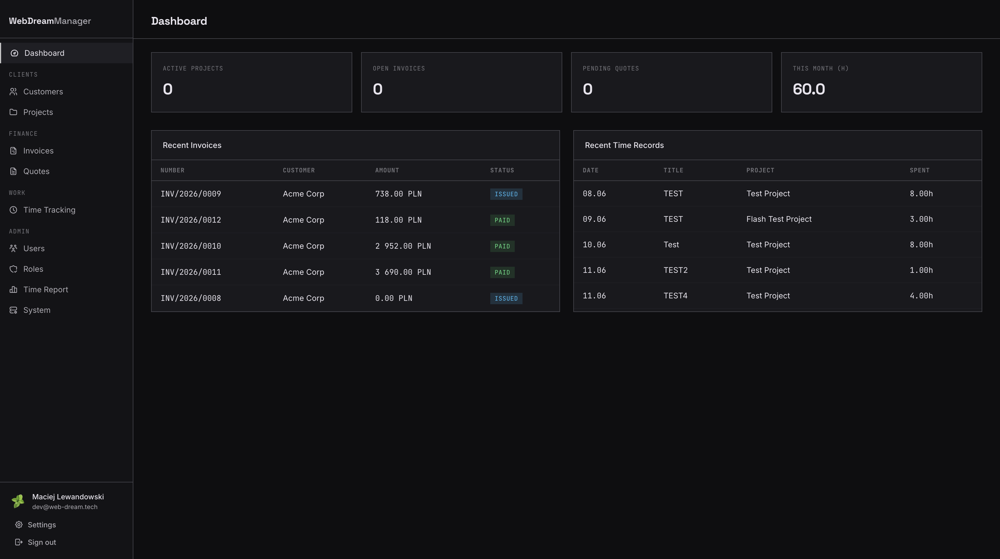
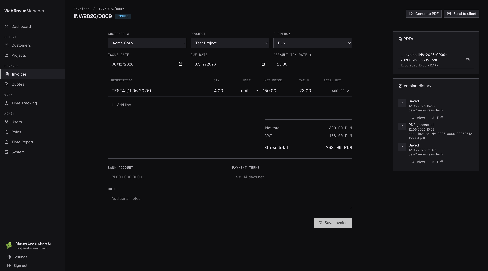
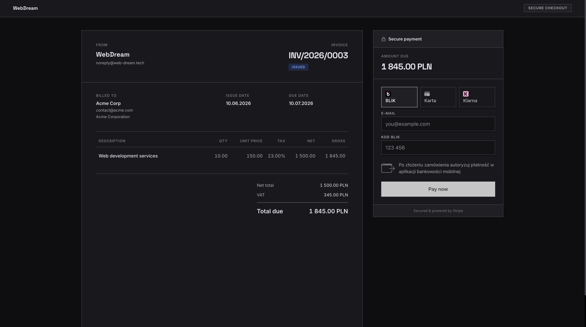
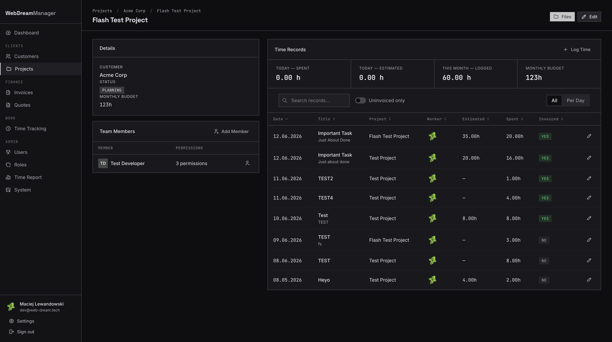
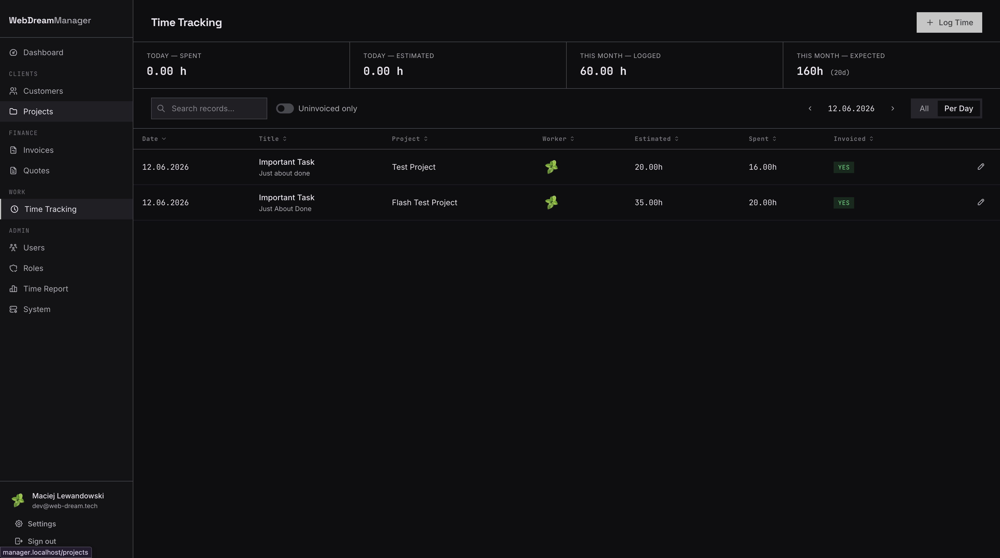
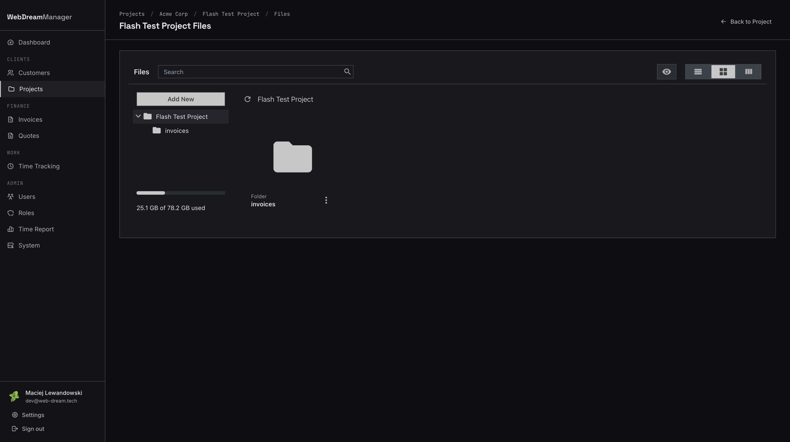
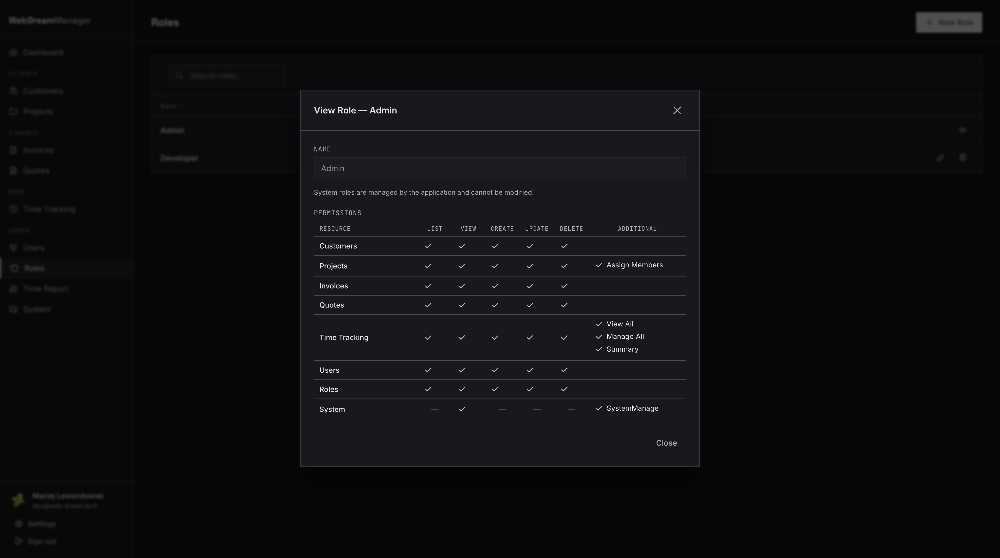
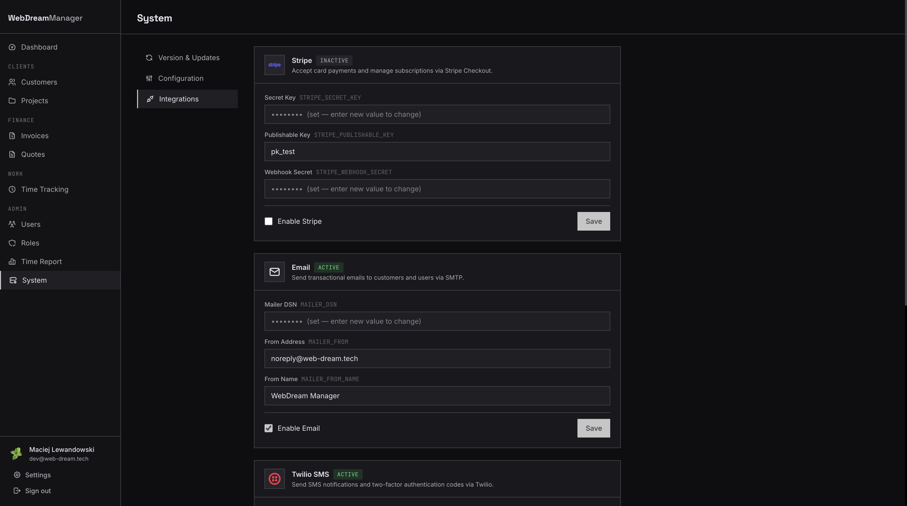
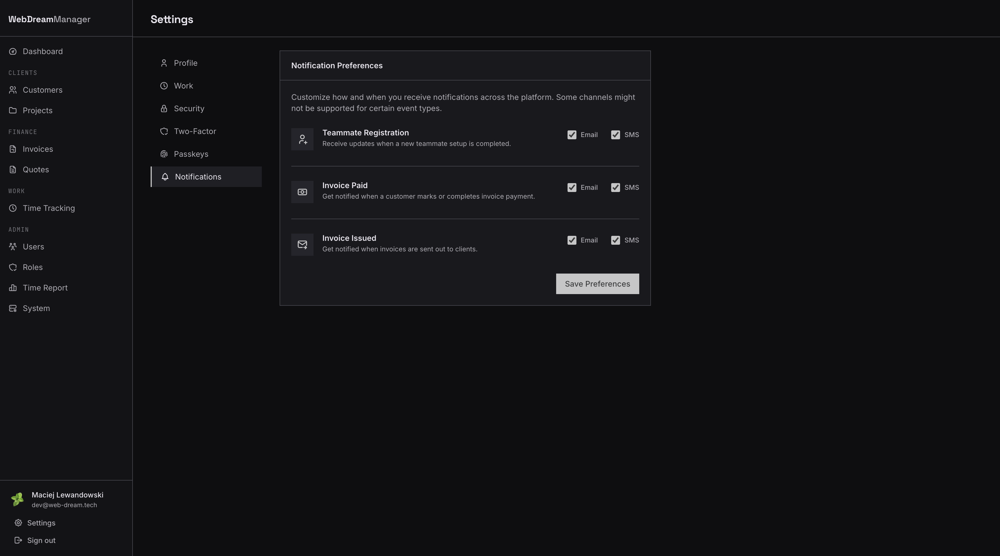

# WebDream Manager

[](https://github.com/maciejlewandowskii/WebDreamManager/actions/workflows/ci.yml)
[](https://github.com/maciejlewandowskii/WebDreamManager/pkgs/container/webdreammanager)
[](https://php.net)
[](https://symfony.com)
[](https://postgresql.org)
[](https://tailwindcss.com)
[](compose.yaml)
[](LICENSE)

Internal business management tool for agencies and freelancers — track clients, projects, invoices, quotes, and time in one place.

---

## Screenshots

<table>
  <tr>
    <td align="center" width="50%">
      
      <br/><sub><b>Dashboard</b></sub>
    </td>
    <td align="center" width="50%">
      
      <br/><sub><b>Invoice Management</b></sub>
    </td>
  </tr>
  <tr>
    <td align="center" width="50%">
      
      <br/><sub><b>Client Payment Portal</b></sub>
    </td>
    <td align="center" width="50%">
      
      <br/><sub><b>Project &amp; Budget Overview</b></sub>
    </td>
  </tr>
  <tr>
    <td align="center" width="50%">
      
      <br/><sub><b>Time Tracking</b></sub>
    </td>
    <td align="center" width="50%">
      
      <br/><sub><b>File Manager</b></sub>
    </td>
  </tr>
  <tr>
    <td align="center" width="50%">
      
      <br/><sub><b>Role-Based Access Control</b></sub>
    </td>
    <td align="center" width="50%">
      
      <br/><sub><b>Integrations</b></sub>
    </td>
  </tr>
  <tr>
    <td align="center" width="50%">
      
      <br/><sub><b>Notification Preferences</b></sub>
    </td>
    <td></td>
  </tr>
</table>

---

## Features

- **Dashboard** — live overview of active projects, open invoices, pending quotes, and hours logged this month
- **Customer & Project Management** — manage clients, team members, and monthly budgets per project
- **Invoicing & Quotes** — create, send, and PDF-export invoices with full version history
- **Stripe Payments** — clients pay directly via a hosted payment page
- **Time Tracking** — log time per task and project with invoiced/uninvoiced filtering and daily summaries
- **File Manager** — per-project file storage
- **Role-Based Access Control** — fine-grained permissions per resource and/or role
- **System Integrations** — Stripe, SMTP email, and Twilio SMS, all configurable from the admin panel
- **Two-Factor Authentication** — TOTP authenticator app, email second, sms factor
- **Passkeys** — Supports Passkeys for login and passwordless authentication
- **Notification Preferences** — per-user email/SMS settings for invoice and system events

## Tech Stack

| Layer | Technology |
|---|---|
| Runtime | PHP 8.5, FrankenPHP |
| Framework | Symfony 8.1 |
| Database | PostgreSQL 16 |
| Frontend | Tailwind CSS v4, Symfony UX (Live Components, Turbo, Stimulus, Icons) |
| Payments | Stripe |
| Infrastructure | Docker |

## Getting Started

### Requirements

- Docker & Docker Compose

### Production setup

1. Download `compose.prod.yaml` and `.env.example` from the [latest release](https://github.com/maciejlewandowskii/WebDreamManager/releases/latest).

```bash
# Rename and configure
mv compose.prod.yaml compose.yaml
cp .env.example .env.prod
# Edit .env.prod — fill in APP_SECRET, DATABASE_URL, MAILER_DSN, etc.

# Start
docker compose up -d

# Create admin user
docker exec webdreammanager-php-1 php bin/console app:create:user
```

> Optionaly uncomment **watchtower** compose.yaml section, to enable automatic updates

## License

MIT — see [LICENSE](LICENSE) for details.

> **Note:** PDF generation relies on [dompdf](https://github.com/dompdf/dompdf) which is LGPL-2.1 licensed. The MIT license of this project applies to application code only and does not extend to dompdf or its sub-dependencies.
